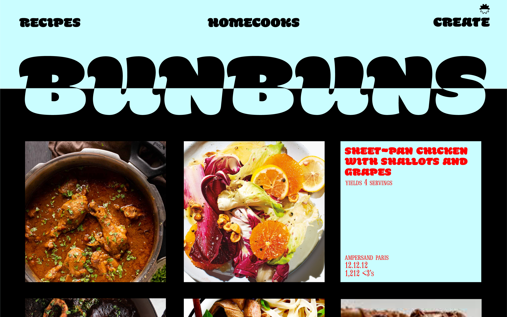
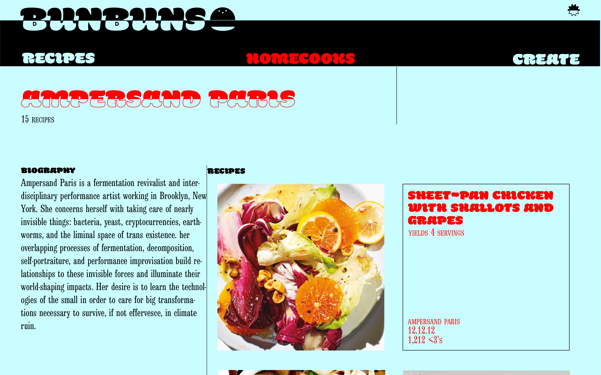

# Application Name:
BUNBUNS

## Concept:
Create a web application that supports the development of recipes and the creation of an online community for homecooks. On the BUNBUNS platform, users create recipes, share recipes along with photos, and follow other homecooks as they navigate the trials, tribulations, and celebrations inside the kitchen. Users have the ability to like and comment in an effort to provide constructive feedback on peer kitchen projects.    
Future development will add features that allow users to generate grocery lists from recipes, save favorite recipes, live-stream cooking events, and search for recipes using advanced filters and tags.

## User Stories

BUNBUNS wants the user to use Google Oauth to create a new account.  
BUNBUNS wants the user to create and share recipes with names, yield, ingredient lists, preparation instructions, and photos.  
BUNBUNS wants the user to be able to comment and like to provide feedback on other user recipes.  
BUNBUNS wants the user to update their recipes as they tweak and revise their recipes.  
BUNBUNS wants the user to follow other homecooks.  
BUNBUNS wants the user to search for and cook other people's recipes.   
Stretch Goals  
BUNBUNS wants the user to save other people's recipes.  
BUNBUNS wants the user to be able to livestream while cooking and testing recipes. 
BUNBUNS wants the user to generate a grocery list from recipes they plan to cooks. 
BUNBUNS wants the user to have more control in searching for the types of recipes they desire to make.  

## User Flow:

## Entity Relationship Diagram:

## Wireframes:

## Technologies Used:
    - Express
    - EJS
    - CSS
    - MongoDB
    - JavaScript

## Approach:

## Challenges:

## Additional information:
Developed by Ampersand, Janice and Dominick

## App Demo
https://github.com/chiangd233/Full-Stack-Web-App/
