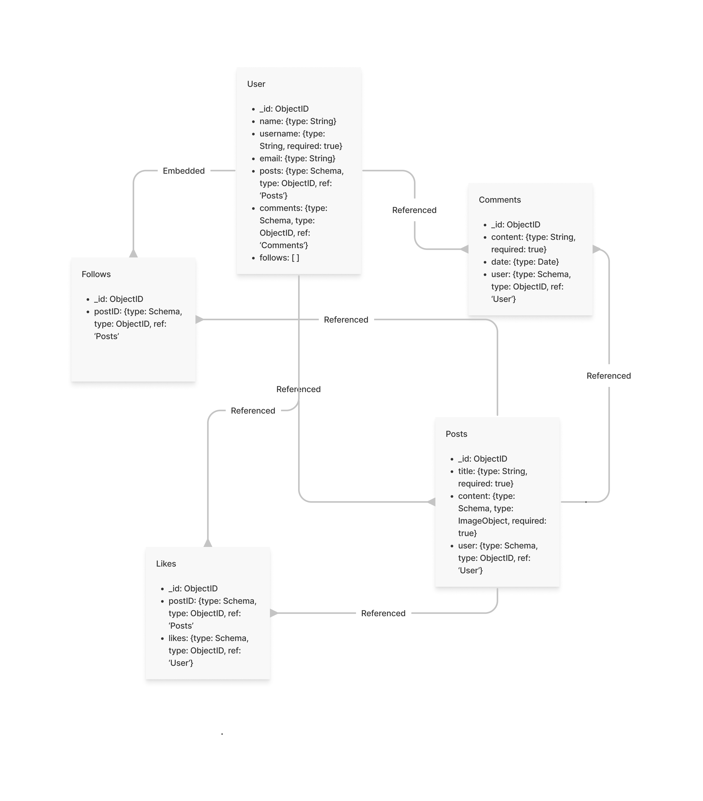

# Application Name
BunBun

## Concept:
Create a web application which allows users to create and account and post recipes of dishes that they took. The application will also allow the user to post photos. The application will also allow the user to look up other people's posting of dishes that they have cooked and like and comment on other people's posts.

## User Stories

I want the user to create an account with a username and password for our application  
I want the user to post recipes and photos of what they cook  
I want the user to update their ingredients/recipes as they cook   
I want the user to look up other people's recipes  
I want the user to be able to like and comment on other user's recipes
I want the user to save other people's recipes  

## User Flow:

## Entity Relationship Diagram:

## Wireframes:

## Technologies Used:
    - Express
    - EJS
    - CSS
    - MongoDB
    - JavaScript

## Approach:

## Challenges:

## Additional information:
Developed by Ampersand, Janice and Dominick

## App Demo
https://github.com/chiangd233/Full-Stack-Web-App/
